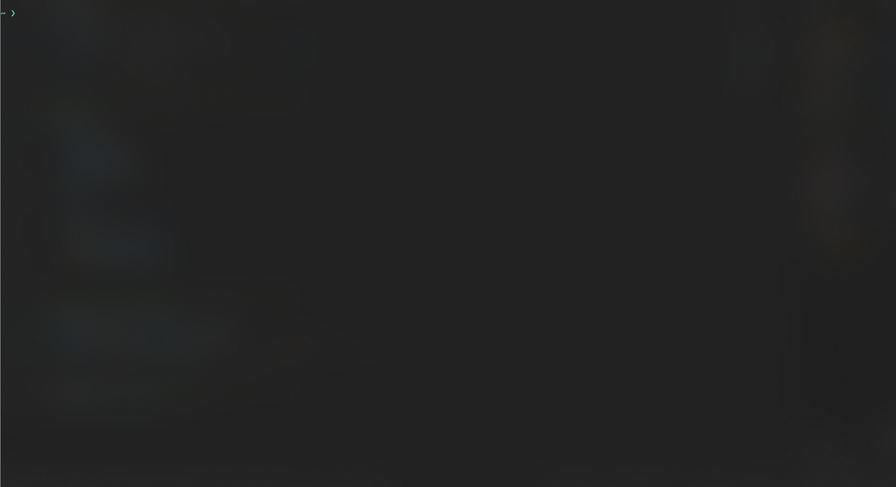

# News and Stocks

A terminal app for browsing SVT Text-TV and stock prices for the OMX30, Lysa Global, and an example global portfolio, right from the command line.



Data via [api.texttv.nu](https://api.texttv.nu) (SVT Text-TV, unofficial) and [Yahoo Finance](https://crates.io/crates/yahoo_finance_api) (stock prices).

Inspired by [Nordre007/SvT](https://github.com/Nordre007/SvT).

## Requirements

- [Rust](https://www.rust-lang.org/tools/install) (via `rustup`)

## Install

```bash
git clone git@github.com:Leo-Haker/news-and-stock.git
cd news-and-stock
cargo install --path .
```

This builds a release binary and installs it as `news` in `~/.cargo/bin` (already on your `PATH` if you installed Rust via `rustup`).

## Run

```bash
news
```

## Usage

```
Startsida: 101, Stänga: q eller quit, Börs: stock
Sida eller börs:
```

- Enter a page number (e.g. `106`, `400`, `700`) to view that Text-TV page.
- Enter `stock` to view current OMX30 prices and daily/monthly/yearly change.
- Enter `q` or `quit`, or press `Ctrl+D`, to exit.
